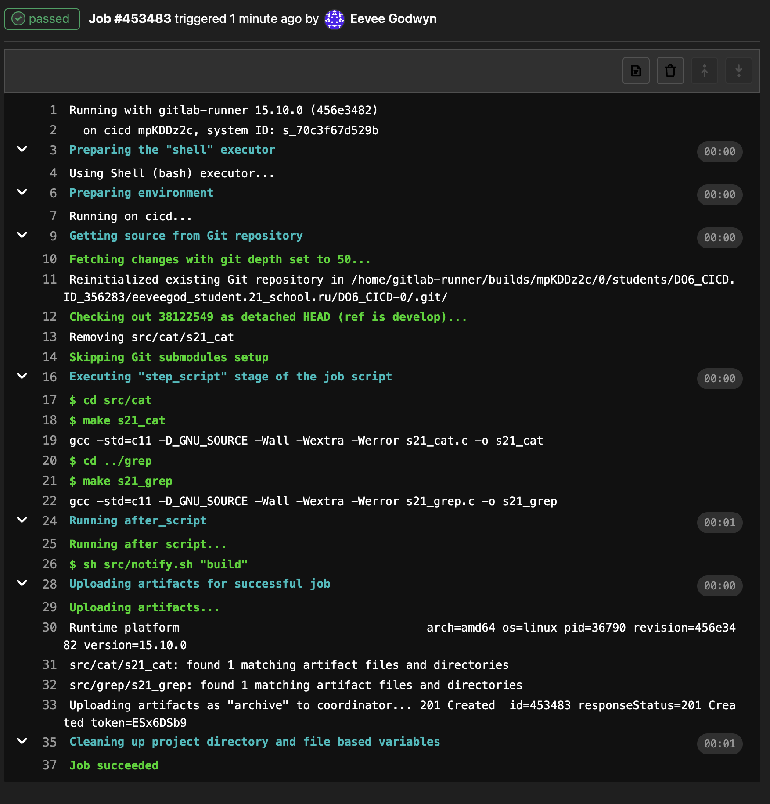
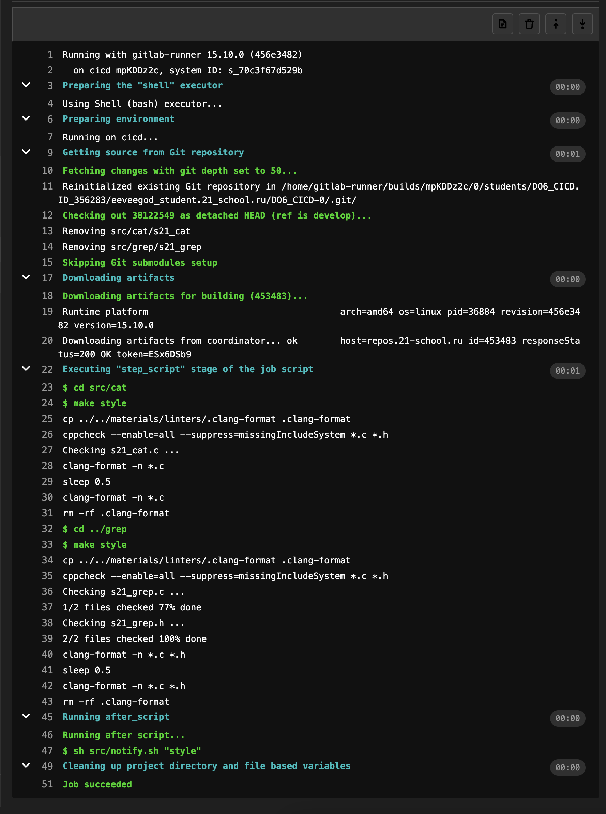
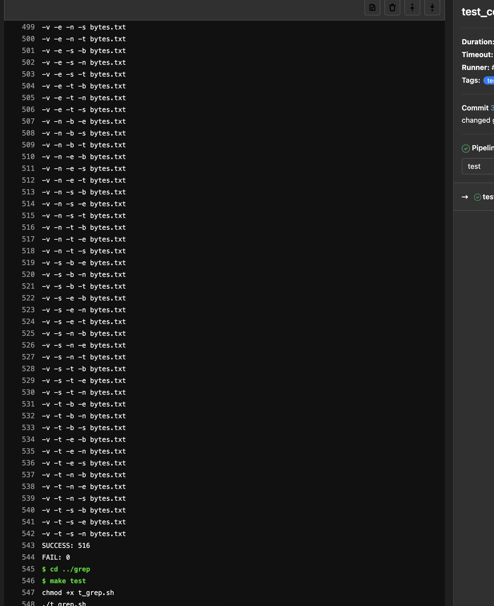
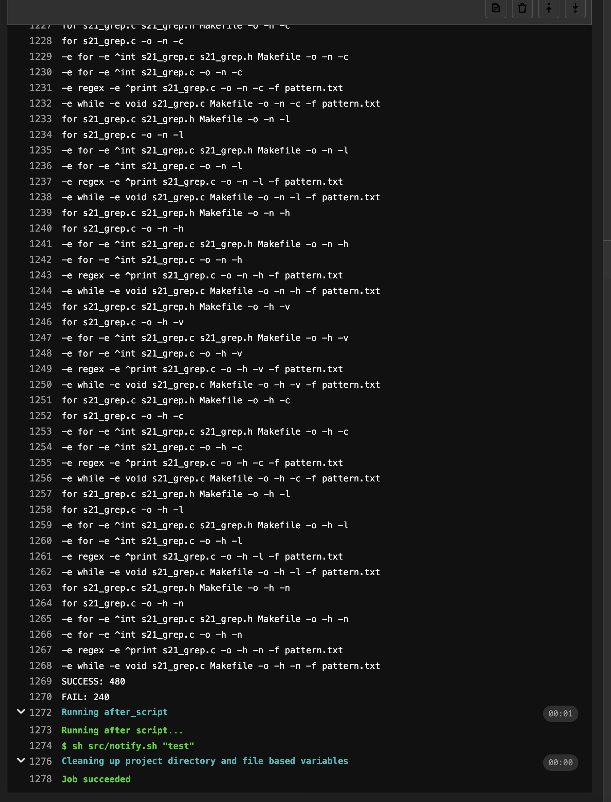
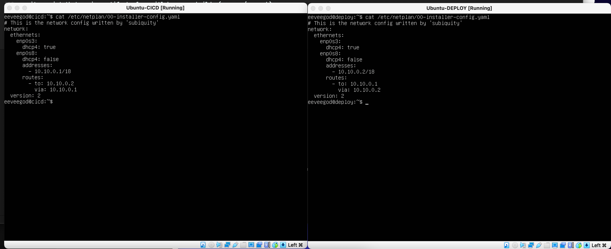
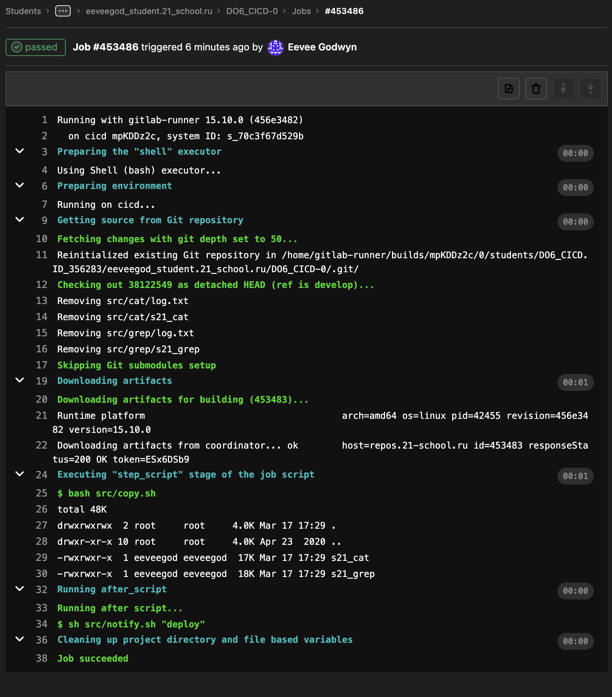
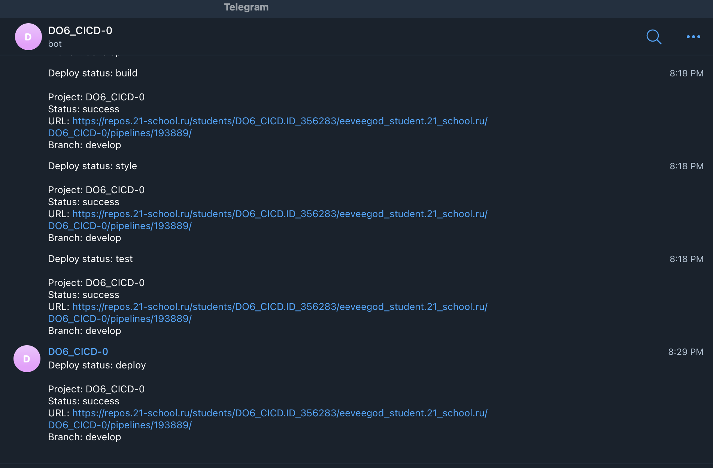

# Basic CI/CD
## Part 1. Настройка gitlab-runner

Установка gitlab-runner 
> sudo curl -L --output /usr/local/bin/gitlab-runner "https://gitlab-runner-downloads.s3.amazonaws.com/latest/binaries/gitlab-runner-linux-amd64" </br>

> sudo chmod +x /usr/local/bin/gitlab-runner </br>

> sudo useradd --comment 'GitLab Runner' --create-home gitlab-runner --shell /bin/bash </br>

> sudo gitlab-runner install --user=gitlab-runner --working-directory=/home/gitlab-runner </br>

> sudo gitlab-runner start </br>

> sudo systemctl enable --now gitlab-runner </br>

Зарегистрируйте gitlab-runner с помощью

> sudo gitlab-runner register
```
    URL: https://repos.21-school.ru
    token: <your_token_from_the_platform>
    -
    tags: build,style,test,deploy,notify
    -
    executor: shell
```
> sudo gitlab-runner verify </br>

> sudo gitlab-runner run </br>

> sudo rm /home/gitlab-runner/.bash_logout (нужно удалить его иначе работать не будет) </br>

Проверьте статус gitlab-runner с помощью
> service gitlab-runner status

## Part 2. Сборка

Создаем вне дирректории src .gitlab-ci.yml (конфиг нужно будет запушить в develop)
> vim .gitlab-ci.yml

.gitlab-ci.yml:
```
building:
  stage: build
  tags: 
    - build
  script:
    - cd src/cat
    - make s21_cat
    - cd ../grep
    - make s21_grep
  artifacts:
    paths:
      - src/cat/s21_cat
      - src/grep/s21_grep
    expire_in: 30 days
```
Результат в случае успеха: 



## Part 3. Тест кодстайла

.gitlab-ci.yml:
```
codestyle:
  stage: style
  tags: 
    - style
  script:
    - cd ${CI_PROJECT_DIR}/src
    - make style
```

Результат в случае успеха:



## Part 4. Интеграционные тесты

.gitlab-ci.yml:
```
test_code:
  stage: test
  tags:
    - test
  script:
    - cd ${CI_PROJECT_DIR}/src
    - make test 
  when: on_success
```

result: 




## Part 5. Этап деплоя

Создайте вторую виртуальную машину для деплоя

Свяжите машины

Важно: 

Для первой машины network > adapter 1 > nat > port forwarding > add new port forwarding rule > host port 2222 - guest 22 </br>
Для первой машины network > adapter 2 > internal network

Для второй машины network > adapter 1 > nat > port forwarding > add new port forwarding rule > host port 9001 - guest 22 </br>
Для второй машины network > adapter 2 > internal network

На обеих машинах должен быть установлен openssh-server

netplan yaml для первой и второй машины:



написать скрипт, который копирует артефакты из сборок gitlab-runner (see src/copy.sh)

разрешить 1-й машине использовать команду ssh без пароля 2-й машины:

> sudo su - gitlab-runner </br>

> ssh-keygen -t rsa -b 2048 </br>

> ssh-copy-id -i ~/.ssh/id_rsa.pub <username>@<ip_address> (ssh-copy-id -i ~/.ssh/id_rsa.pub eeveegod@10.10.0.2) </br>

даем все права на папку 2-й машины куда копируем наши артефакты(прописываем во второй машине):

> sudo chmod -R 777 /usr/local/bin/

.gitlab_ci.yml:
```
deploy:
  stage: deploy
  tags:
    - deploy
  script:
    - bash src/copy.sh
  when: manual
```
<sub> manual позволяет выбрать, хотите ли вы пройти этап развертывания или нет </sub>

Результат в случае успеха: 



## Part 6. Дополнительно. Уведомления

create telegram bot using @BotFather

get the bot's token and use it in our script from materials/notification.md (see src/notify.sh)

add telegram profile id and job_status ($CI_JOB_STATUS) to the script

add this to every job in .gitlab-ci.yml:
```
  after_script:
    - sh src/notify.sh "job_name"
```

Результат в случае успеха:



## Полезные ссылки

* https://repos.21-school.ru/help/ci/quick_start/index.md
* https://docs.gitlab.com/runner/
* https://www.dmosk.ru/miniinstruktions.php?mini=gitlab-runner-web#runner-register
* https://repos.21-school.ru/help/ci/yaml/README
* https://docs.gitlab.com/runner/install/linux-manually.html
